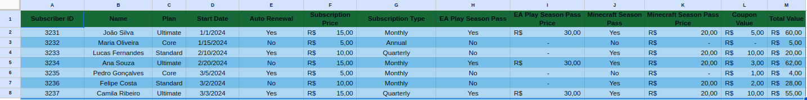
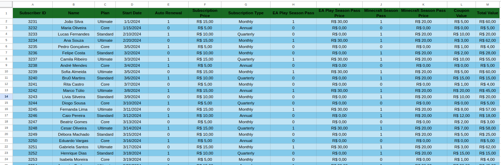
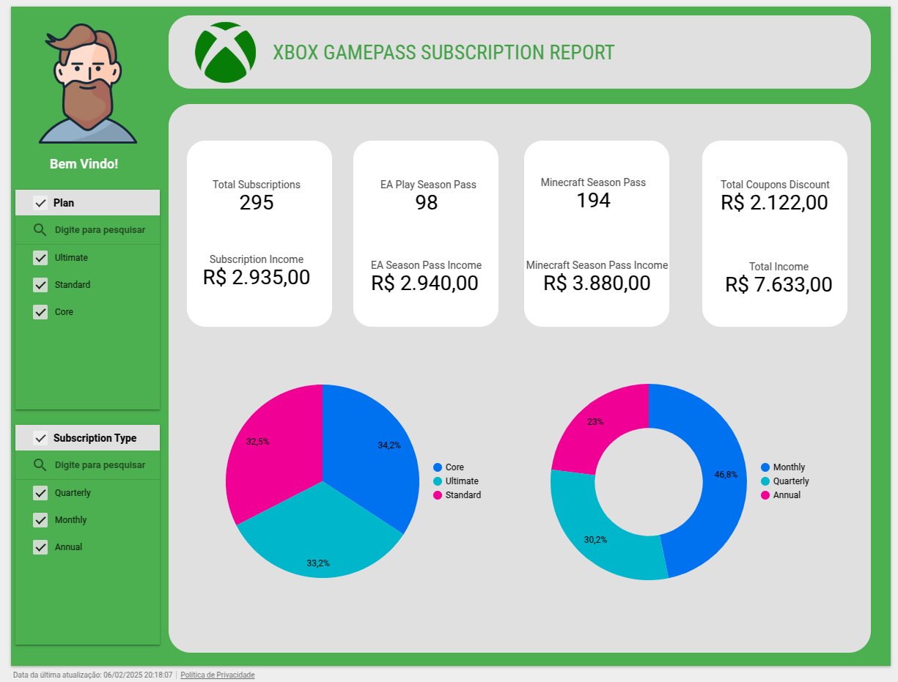
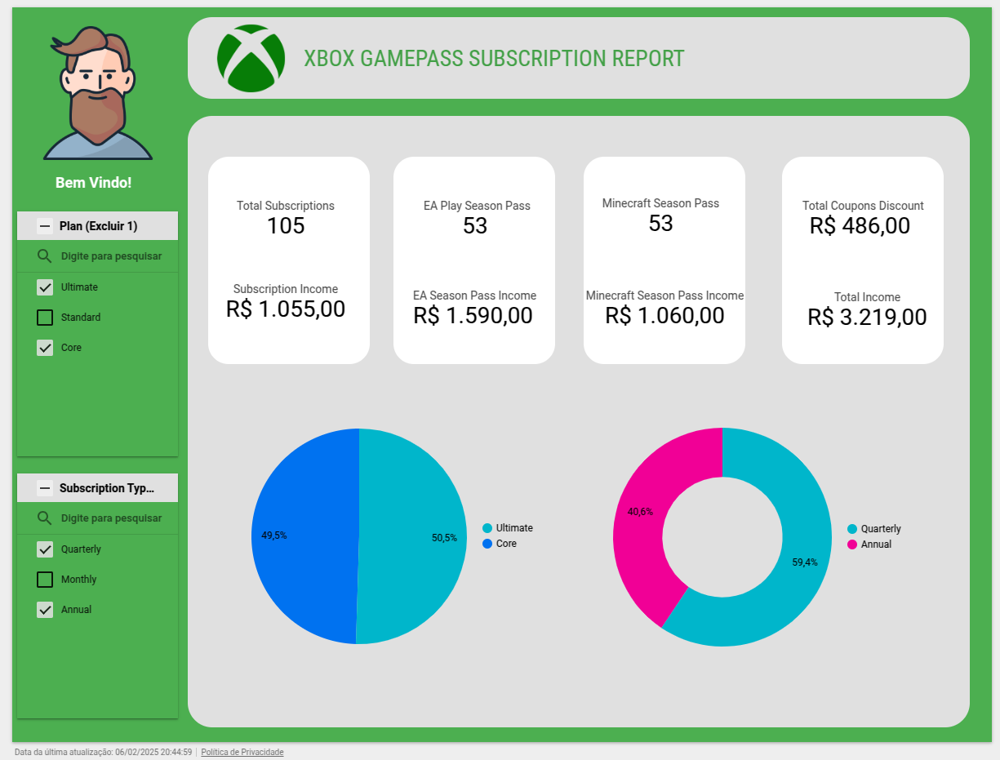

<h1>
    <a href="https://www.dio.me/">
     </a>
    <span>Heineken - Inteligência Artificial Aplicada a Dados com Copilot</span>
</h1>

# :computer: Desafio de projeto: Criando um Dashboard de Vendas do Xbox

O objetivo deste desafio é criar um dashboard de vendas, com foco na organização e visualização de dados. O objetivo é transformar dados brutos em informações visuais claras e úteis, permitindo uma análise eficaz do desempenho de vendas e a tomada de decisões baseadas em dados.

# :bulb: Solução do desafio

## Dashboard fornecido pelo instrutor

<p align=center>

<p/>

<p align=center>

<p/>

## Explorando os dados com IA

Utilizando o Gemini Advanced 2.0 Flash com o prompt

```
Dado a planilha e dashboard fornecidos, faça uma análise dos dados e sugira melhorias no dashboard e novos insights baseados nos dados.
```

Obtemos uma resposta que serve como guia para aprimorar o dashboard: 

**Análise dos Dados**

* **Tipos de Assinatura e Receita:** Os dados mostram vários tipos de assinatura (ex: Mensal, Anual, Trimestral) com diferentes preços. Analisar a distribuição desses tipos e a receita associada a cada um pode revelar quais são os mais populares e geram mais receita.

* **Renovação Automática:** Os dados indicam se as assinaturas têm a renovação automática habilitada. Analisar a proporção de assinaturas com renovação automática fornece insights sobre a retenção de clientes e a potencial perda de clientes (churn).

* **Passes de Temporada:** Os dados incluem informações sobre os passes de temporada EA Play e Minecraft. Analisar as taxas de adoção desses passes e seu impacto na receita geral pode ser valioso.

* **Valor do Cupom:** Os dados mostram o valor dos cupons usados. Analisar a distribuição dos valores dos cupons e seu impacto nas escolhas de assinatura pode revelar o comportamento do cliente e as estratégias de preços em potencial.

**Melhorias no Dashboard**

* **Visualizar a Distribuição do Tipo de Assinatura:** Crie um gráfico de pizza ou gráfico de barras para visualizar a distribuição dos diferentes tipos de assinatura. Isso ajudará a entender rapidamente a popularidade de cada tipo.

* **Acompanhar a Taxa de Renovação Automática:** Exiba a porcentagem de assinaturas com renovação automática habilitada. Essa métrica pode ser acompanhada ao longo do tempo para monitorar os esforços de retenção de clientes.

* **Analisar a Adoção do Passe de Temporada:** Crie gráficos para mostrar as taxas de adoção dos passes de temporada EA Play e Minecraft. Isso pode ajudar a avaliar o sucesso dessas ofertas.

* **Visualizar o Uso do Cupom:** Crie um histograma ou gráfico de caixa para visualizar a distribuição dos valores dos cupons. Isso pode ajudar a entender o comportamento do cliente e as estratégias de preços.

**Novos Insights**

* **Segmentação de Clientes:** Segmente os clientes com base no tipo de assinatura, status de renovação automática e adoção do passe de temporada. Isso pode ajudar a personalizar as estratégias de marketing e retenção.

* **Previsão de Churn:** Analise dados históricos para identificar fatores que contribuem para o churn (ex: tipo de assinatura, uso de cupom). Isso pode ajudar a prever e prevenir o churn futuro.

* **Otimização de Preços:** Analise o impacto de diferentes estratégias de preços e valores de cupons nas escolhas de assinatura. Isso pode ajudar a otimizar os preços para maximizar a receita.

* **Empacotamento de Passe de Temporada:** Explore o potencial de empacotar passes de temporada com diferentes tipos de assinatura para aumentar a adoção e a receita.

**Considerações Adicionais**

* **Limpeza de Dados:** Os dados podem precisar de limpeza para resolver valores ausentes ou inconsistências.

* **Validação de Dados:** Valide os dados para garantir precisão e confiabilidade.

* **Visualização de Dados:** Escolha gráficos e tabelas apropriados para comunicar os insights de forma eficaz.

* **Design do Dashboard:** Projete o dashboard para ser amigável e informativo.

## Fazendo dashboard com Google Looker

Primeiro importei a tabela no planilhas google e fiz uma limpeza nos dados

<p align=center>

<p/>

- Yes = 1
- No = 0
- Conversão para moedas e preenchimento de valor R$ 0,00

Conectei a planilha ao Google Looker Studio.

- Filtro por Plano
- Filtro por Tipo de Assinatura
- Número de assinaturas 
- Receita por assinaturas

<p align=center>

<p/>

<p align=center>

<p/>